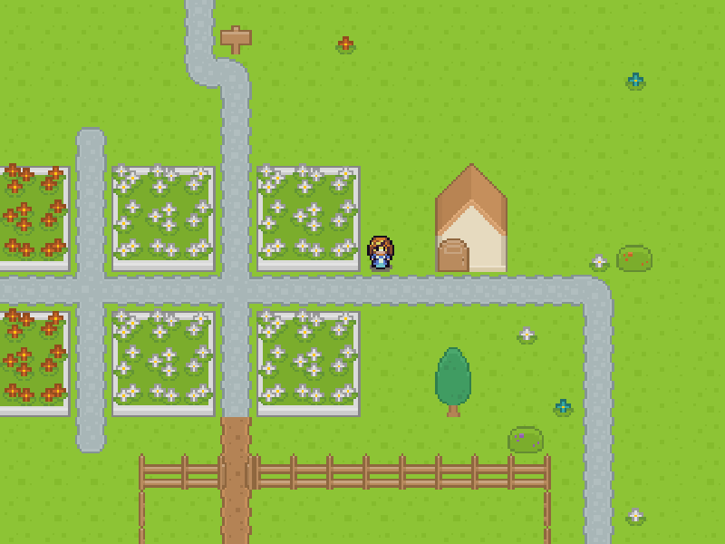

# Athena

A example game about role and playing.

## Developing

* Open the project in IntelliJ IDEA
* Start DesktopLauncher.main()-method
* Edit starter (Run/Debug Configuration) and set working directory to android\assets
* Start the method again

## Credits

### Assets

* Characters (https://opengameart.org/content/tiny-16-expanded-character-sprites) (CC-BY) 

* Town Music (https://opengameart.org/content/town) (CC0)

* All other Graphic, Fonts and sounds by Kenney (https://www.kenney.nl/assets) (CC0)

## Authors

* seeseekey - https://seeseekey.net
* Naxos84 - https://github.com/Naxos84/

## License

The source code is licensed under MIT license.